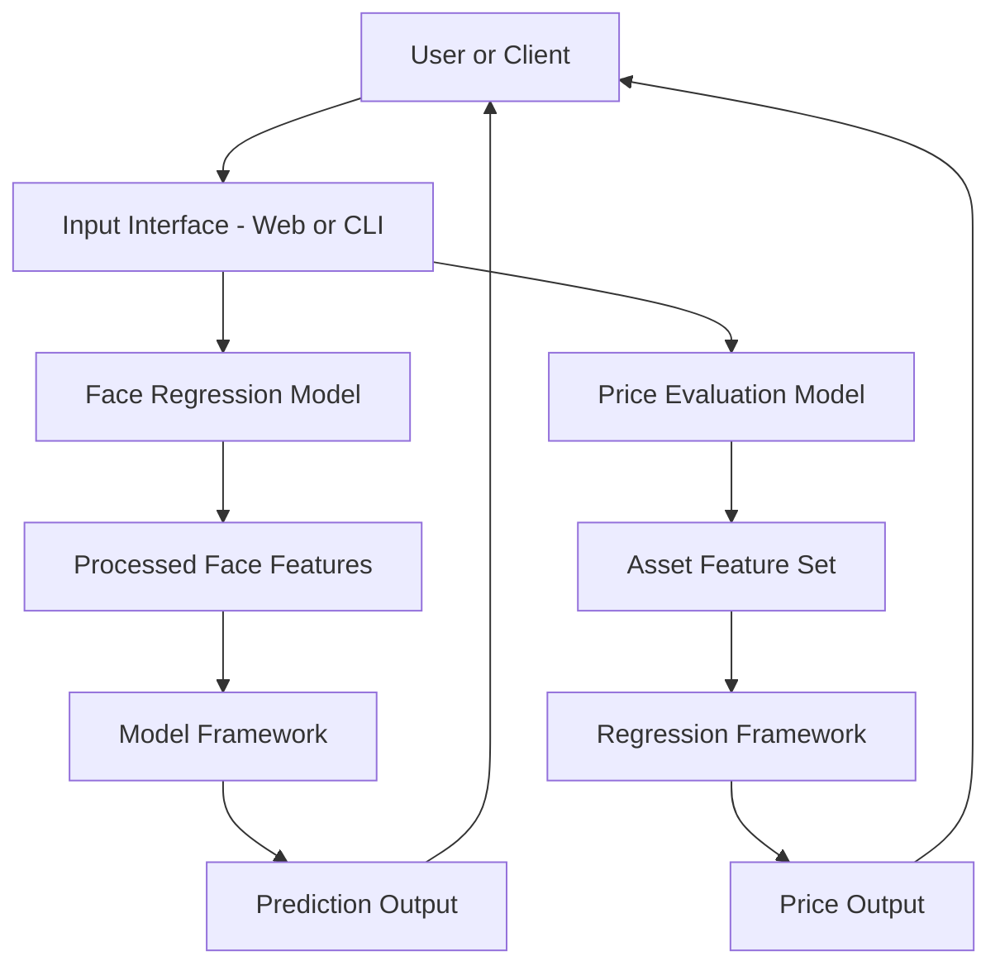

# 🤖 Face Regression & Price Evaluating Models

[](#license)  
[]()  
[]()  
[]()

> A dual-model AI suite: one for **face-based regression** (e.g., attribute prediction) and another for **price evaluation** (e.g., object/asset pricing). Built with machine learning libraries, confident metrics, and production-ready pipelines.

---

## 🖥️ Overview

This repository contains two primary models:

1. **Face Regression Model** — Predicts numeric or continuous attributes from facial imagery (e.g., age, attractiveness, risk score).  
2. **Price Evaluating Model** — Estimates the fair market value or price of assets (cars, electronics, real estate) using regression techniques.

Together, they showcase end-to-end pipelines: data preparation, training, evaluation, and inference.

---

## 🧱 Tech Stack

| Layer            | Technology |
|------------------|-----------|
| Programming      | Python (≥ 3.9) |
| Data Science     | NumPy, pandas, scikit-learn, TensorFlow / PyTorch |
| Regression Models| Linear Regression, Random Forest, Neural Networks |
| Data Storage     | CSV / Parquet / SQL databases |
| Deployment       | Flask / FastAPI + Docker |
| Metrics & Logs   | MLflow or custom logging |

---

## ✨ Features

- 📷 Face-image regression: Pre-trained model for age, emotion, face-score predictions  
- 💰 Asset pricing model: Predict price based on features like age, condition, usage  
- 📊 Evaluation outputs: MAE, RMSE, R², and visualization dashboards  
- 🧪 Training pipeline: Data ingestion → preprocessing → training → validation → inference  
- 🛠️ Inference API: Serve predictions via REST endpoints  
- 🧮 Explainability: Feature importance, SHAP values (optional)  

---

## 🗺️ Architecture Diagram


# ⚙️ Getting Started
1️⃣ Clone the repository
```bash
git clone https://github.com/AbdullahBakouni/Face-regression-and-price-evaluating-models.git
cd Face-regression-and-price-evaluating-models
```
2️⃣ Install dependencies
```bash
pip install -r requirements.txt
```
3️⃣ Environment Variables

Create a .env file at the root:
```env
# Paths & Dataset
DATA_PATH=./data
FACE_MODEL_PATH=./models/face_regression.pkl
PRICE_MODEL_PATH=./models/price_eval.pkl

# Logging
LOG_LEVEL=INFO
MLFLOW_TRACKING_URI=http://localhost:5000

# Model Params
FACE_BATCH_SIZE=32
PRICE_BATCH_SIZE=64
```

4️⃣ Run training
```bash
python train_face_regression.py --config configs/face.yaml
python train_price_model.py --config configs/price.yaml
```
5️⃣ Run inference API
```bash
uvicorn app.main:app --host 0.0.0.0 --port 8000
```
# 🧪 Example Usage

Face Regression Inference
```bash
curl -X POST http://localhost:8000/predict/face \
  -H "Content-Type: application/json" \
  -d '{ "image": "base64encodedjpg" }'
```

Response:
```json
{
  "prediction": 34.2,
  "confidence": 0.87
}
```

Price Evaluation Inference
```bash
curl -X POST http://localhost:8000/predict/price \
  -H "Content-Type: application/json" \
  -d '{ "age": 3, "mileage": 25000, "brand": "BrandX", "condition": "Good" }'
```

Response:
```json
{
  "estimated_price": 22000,
  "confidence": 0.79
}
```
# 🐳 Docker Setup
```bash
docker build -t face-price-models .
docker run -p 8000:8000 face-price-models
```
# 🛣️ Roadmap

 Extend face model to full gender, emotion & landmark regression

 Integrate real-time video stream inference

 Add online learning / continual training

 Build dashboard UI for model dashboard & analytics

# 🤝 Contributing

Your contributions are welcome!

Fork the repo

Create a branch (git checkout -b feature/your-improvement)

Commit changes (git commit -m "Add model X")

Push and submit a PR 🎉

# 📜 License

MIT © 2025 [Abdullah Bakouni](https://github.com/AbdullahBakouni)
